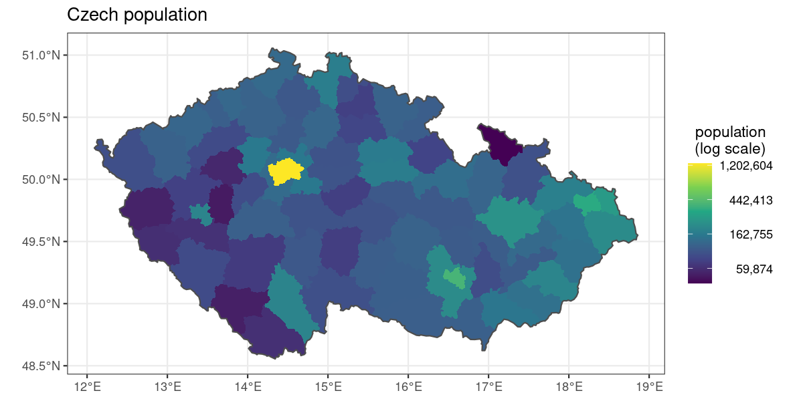
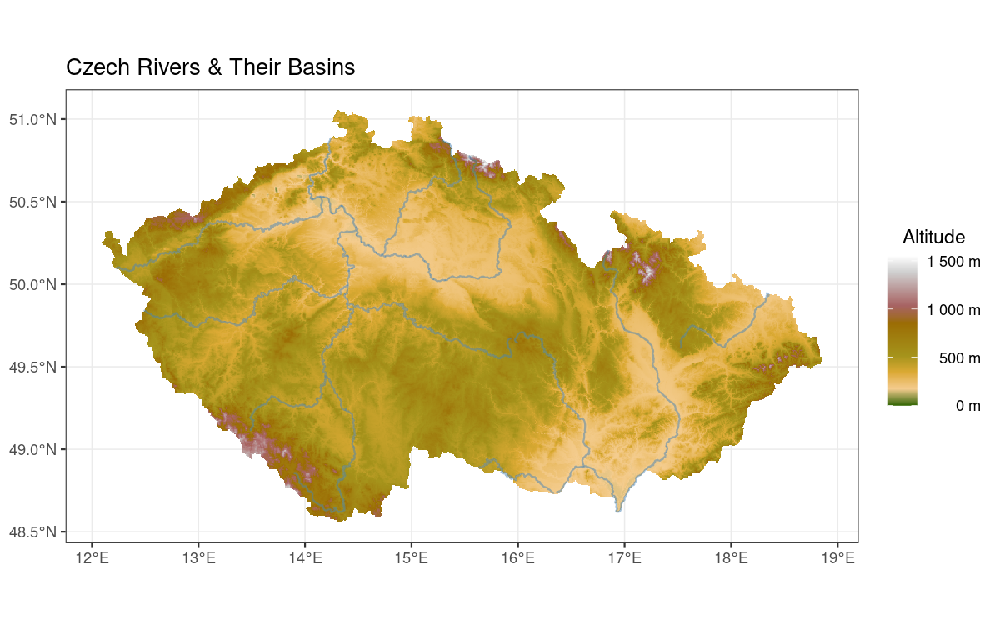

# Summary
`RCzechia` is a R package providing spatial objects and spatial information relevant in the context of the Czech Republic for spatial data analysis and visualization purposes. The package uses `sf` data format to serve the most commonly used administrative areas and natural objects. 

As the underlying data is by necessity larger than CRAN package size limits allow, the data is stored externally and a working internet connection is required to use the package.

# State of the field
The history of spatial data analysis in `R` is long and respectable @bivand21. The first packages focusing specifically on providing spatial data originate from the `S` days @becker_wilks93, with `maps` @deckmyn22 being one of the oldest packages in continuous use on CRAN (since 2003). The early packages used pattern of storing spatial data internally, which created a hard limit on volume and level of detail stored. 

With the advent of `sp` @pebesma_bivand05 and later `sf` @pebesma18 platforms for handling spatial data the universe of packages focused on providing spatial data blossomed. There are packages with global focus, such as `rnaturalearth` @south17 and regional focus like `giscoR` @hernangomezdiego22 oriented at the EU. Number of packages are country specific, such as `tigris` @walker_rudis22 for the US, or `rgugik` @dyba_nowosad21 for Poland. With current near universal and reliable internet access a new pattern has emerged, with spatial data packages accessing cloud stored data files as required (caching them within the limits set by the [CRAN repository policy](https://cran.r-project.org/web/packages/policies.html)), and distributing only lightweight code.

In the context of Czech Republic there exists `CzechData` package @caha21, with somewhat overlapping functionality but available only on GitHub. The CRAN package `czso` @bouchal22 interfaces API of the Czech Statistical Office [ČSÚ](https://www.czso.cz/csu/czso/home), providing access to statistical data about Czech administrative areas (without the spatial information itself). Package `pragr` @bouchal20, available on GitHub, provides geodata about the city of Prague.

# Statement of need
No country specific spatial data package has been published on CRAN for the Czech Republic to date, creating a need that could be filled using global or regional packages only to a limited extent.

While there there are open data resources available for researchers, mostly in the format of ESRI Shapefiles, these have a number of practical disadvantages. They have to be located and downloaded individually, and their users in R context face additional hurdles, such as conflicting Coordinate Reference Systems and character encodings. In addition some publicly available datasets are topologically invalid and many are too detailed for use by non GIS specialized audience.

# Features
The package provides two distinct sets of spatial objects: administrative areas, and natural objects. In addition API interface wrapping is provided for geocoding and reverse geocoding functions.

### Administrative area polygons:

* **republika**: borders of the Czech Republic as a polygon
* **kraje**: 14 regions (NUTS3 areas) of the Czech Republic + Prague as a special case
* **okresy**: 76 districts (LAU1 areas) of the Czech Republic + Prague as a special case
* **orp_polygony** 205 municipalities with extended powers + Prague as a special case
* **obce_polygony**: 6.258 municipalities of the Czech Republic
* **obce_body** the same as obce_polygony, but centroids instead of polygons
* **casti**: primarily 57 city parts of Prague, but also of other cities for which individual boroughs are defined
* **senat_obvody**: 81 Senate districts (upper chamber of Czech Parliament)
* **volebni_okrsky**: 14.761 general election districts
* **zip_codes**: 2.671 ZIP code areas 

The country (NUTS1), regions (NUTS3) and districts (LAU1) administrative level objects from `RCzechia` are functionally equivalent to those provided by `giscoR` package @hernangomezdiego22 for the Czech Republic. This is expected, as GISCO objects are standardized at the EU level, and the Czech Republic is a EU member state.

### Natural objects:

* **reky**: streams and rivers
* **plochy**: stillwaters (lakes and ponds)
* **silnice**: roads (highways, speedways etc.)
* **zeleznice**: railroads
* **chr_uzemi**: protected natural areas 
* **lesy**: woodland areas (more than 30 ha in area)
* **KFME_grid**: KFME grid cells according to @niklfeld71
* **vyskopis**: terrain of the Czech republic as a `raster` @hijmans22 package object

All objects are implemented as functions returning `sf` class data frames, so commands must be followed by brackets i.e. `RCzechia::republika()`.

For some of the most commonly used objects (*republika*, *kraje*, *okresy*, *reky* and *volebni_okrsky*) an optional low resolution version is also included. To access it, specify the value of `resolution` parameter as `"low"` (default is `"high"`). 

### Utility functions:

* **geocode**: geocodes an address to coordinates
* **revgeo**: reverse geocodes coordinates to an address

The utility functions interface API of the Czech State Administration of Land Surveying and Cadastre ([ČÚZK](https://cuzk.cz/en)) and are therefore limited in scope to the area of the Czech Republic.

The package code is thoroughly tested, with 100% test coverage. In addition to testing code the package implements unit tests on integrity of the datasets provided, such as topological validity and internal consistency between different levels of administrative units.

\newpage  
# Examples of use
Czech population at the LAU1 level as per the 2011 census, accessed via `czso` package from API of Czech Statistical Office, and mapped using `RCzechia::okresy()` and a `ggplot2` @wickham16 call. Note the use of low resolution objects to achieve a more stylized look.

``` r
src <- czso::czso_get_table("SLDB-VYBER") %>% 
   select(uzkod, obyvatel = vse1111) %>% 
   mutate(obyvatel = as.numeric(obyvatel)) 

okresni_data <- RCzechia::okresy("low") %>% 
  inner_join(src, by = c("KOD_OKRES" = "uzkod")) 

ggplot(data = okresni_data) +
  geom_sf(aes(fill = obyvatel), colour = NA) +
  geom_sf(data = RCzechia::republika("low"), color = "gray30", fill = NA) +
  scale_fill_viridis_c(trans = "log", labels = scales::comma) +
  labs(title = "Czech population",
       fill = "population\n(log scale)") +
  theme_bw() +
  theme(legend.text.align = 1,
        legend.title.align = 0.5)
```

<center>



</center>

\newpage  
Terrain of the Czech Republic, accessed via `RCzechia::vyskopis()` call and displayed using `ggplot2` together with major rivers `RCzechia::reky()` for context.

``` r
relief <- vyskopis("actual", cropped = TRUE)

ggplot() +
  tidyterra::geom_spatraster(data = relief) +
  geom_sf(data = subset(RCzechia::reky(), Major == T), # major rivers
          color = "steelblue", alpha = .5) +
  scale_fill_gradientn(colors = hypso.colors2(10),
                       labels = scales::label_number(suffix = " m"),
                       limits = c(0, 1550),
                       na.value = NA) +
  labs(title = "Czech Rivers & Their Basins",
       fill = "Altitude") +
  theme_bw() +
  theme(axis.title = element_blank(),
        legend.text.align = 1,
        legend.title.align = 0.5)
```

<center>



</center>

Examples of `RCzechia` use in current research applications include @korecky_etal21 and @brejcha_etal21.

# References
